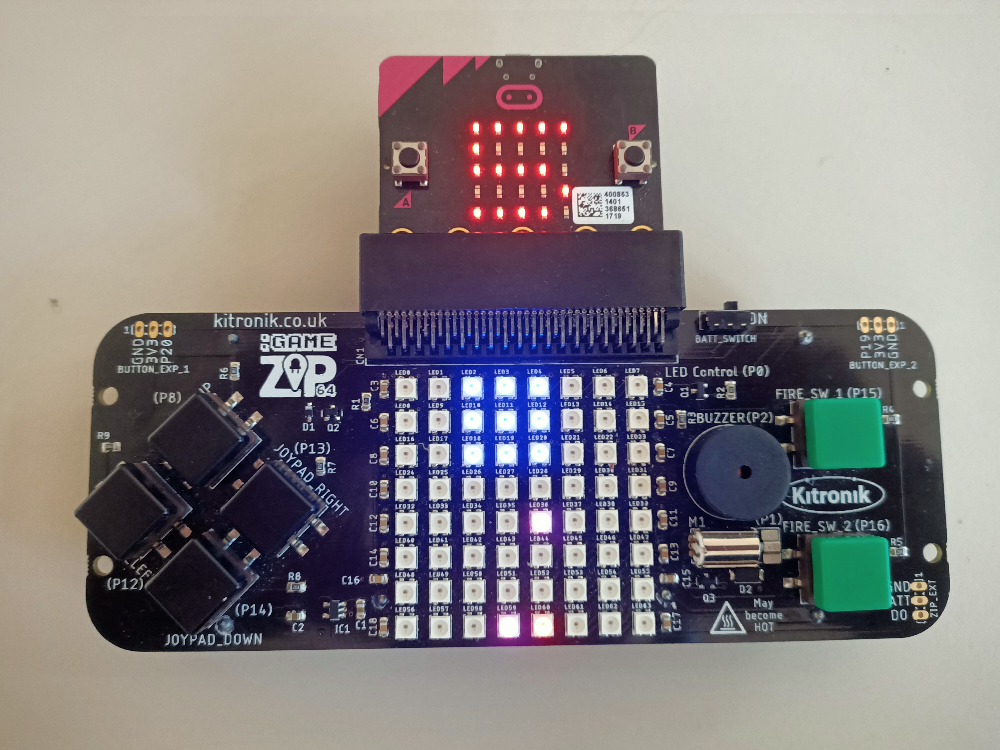

# kitronik-space-invaders

This repo contains a project I needed to make for school. It is space invaders for on the micro:bit with a [:GAME ZIP 64](https://kitronik.co.uk/products/5626-game-zip-64-for-the-bbc-microbit) attached.



## Table of contents

-   [Goals](#goals)
-   [How does it work](#how-does-it-work)
-   [Tools](#tools)
-   [Dev](#dev)
-   [Documentation reference](#documentation-reference)
-   [License](#license)

## Goals

-   Player
    -   Moving left and right
    -   Firing bullets
    -   5 lives
    -   When hit, loses one live and bullet is destroyed
-   Enemies
    -   Firing bullets
    -   Moving in a zigzag pattern down
    -   In patterns with different number of lives
    -   When hit, loses one live and bullet is destroyed
-   Endless playable but it gets faster
-   Waves

## How does it work

This project was quite difficult because the micro:bit hasn't got much memory. I made the program as small as possible. I was first planning to use classes but those take up a lot of space in memory. This wasn't a problem for the player, since there was only one. The player properties are a x and y position and lives. The y position was constant so I could leave that out. However, the enemies where in larger numbers. I put the enemies in a matrix with the values being the lives of the enemies. To move all the enemies, the program removes a column or row and then adds one on the other end. The bullets work the same way but they are all in a different matrix and the bullets all have a value of one.

```python
# Moves enemies.
if rounds % enemySpeed == 0:
    if enemyDirection == 0:
        for i in enemies:
            del i[7]
            i.insert(0, 0)
    if enemyDirection == 1:
        del enemies[7]
        enemies.insert(0, [0 for i in range(8)])
    if enemyDirection == 2:
        for i in enemies:
            del i[0]
            i.append(0)
    if enemyDirection == 3:
        del enemies[7]
        enemies.insert(0, [0 for i in range(8)])
```

To check collision and draw the object I made a loop that checks all 64 spots in the matrix. Every check is done in this loop to make it faster. For example, to check if a bullet and an enemy are at the same location the program looks if there is a bullet at the spot it's currently checking and if thats true it check if there is also an enemy.

```python
# Draw bullets.
if playerBullets[i][j]:
    # PlayerBullets collides with enemies.
    if enemies[i][j]:
        enemies[i][j] -= 1
        playerBullets[i][j] = 0
        continue
    np[j+i*8] = (0, 10, 0)
```

The enemy waves are stored in a list of 2d lists.

```python
enemyPatterns = [
    [
        [0, 0, 1, 1, 1, 0, 0, 0],
        [0, 0, 1, 1, 1, 0, 0, 0],
        [0, 0, 1, 1, 1, 0, 0, 0],
        [0, 0, 0, 0, 0, 0, 0, 0],
    ],
    [
        [0, 0, 1, 1, 1, 0, 0, 0],
        [0, 1, 0, 1, 0, 1, 0, 0],
        [0, 0, 1, 1, 1, 0, 0, 0],
        [0, 1, 0, 1, 0, 1, 0, 0],
    ],
    [
        [1, 1, 1, 1, 1, 1, 1, 0],
        [2, 2, 2, 2, 2, 2, 2, 0],
        [0, 0, 0, 0, 0, 0, 0, 0],
        [0, 3, 0, 4, 0, 3, 0, 0],
    ],
    [
        [1, 1, 1, 1, 1, 1, 1, 0],
        [2, 2, 2, 2, 2, 2, 2, 0],
        [3, 3, 3, 3, 3, 3, 3, 0],
        [4, 4, 4, 4, 4, 4, 4, 0],
    ]
]
```

Only the top half is saved to save memory. When a new wave is loaded is calculates with pattern to use with the formula below.

```python
wave % len(enemyPatterns)
```

Then the extra four rows are added.

```python
for i in range(4):
    enemies.append([0, 0, 0, 0, 0, 0, 0, 0])
```

When all the patterns are completed then the game becomes a bit faster and the patterns will start from the beginning.

The enemies shoot bullets at random. For each enemy there is a one percent chance to shoot a bullet each round.

The player moves when `JOYPAD_RIGHT` and `JOYPAD_LEFT` are pressed. There is also a cool down. Each time the player moves it saves which round it was and only moves when a set number of rounds have passed since then.

```python
if pin13.read_digital() == 0 and x < 7 and rounds - lastMoved >= moveSpeed:
    x += 1
    lastMoved = rounds
if pin12.read_digital() == 0 and x > 0 and rounds - lastMoved >= moveSpeed:
    x -= 1
    lastMoved = rounds
```

The shooting works the same as moving. When `FIRE_SW_1` is pressed a bullet is spawned at the location of the player.

```python
if pin15.read_digital() == 0 and rounds - lastBulletsShot >= shootCoolDown:
    playerBullets[6][x] = 1
    lastBulletsShot = rounds
```

## Tools

This project is made with uFlash. uFlash can be used to flash a python file and the micropython runtime. You also have to import the [microbit module](https://microbit-micropython.readthedocs.io/en/v2-docs/) to control the micro:bit. Before flashing the python file I minified it with pyminifier.

## Dev

To flash the python file to the micro:bit I used uFlash. First you need to install python. I recommend just downloading it from the [official website](https://www.python.org/).

After installing, make sure python is added to path. Install uFlash with pip.

`pip install uflash`
or for python3
`pip3 install uflash`

Then install pyminifier.

`pip install pyminifier`
or for python3
`pip3 install pyminifier`

Now get your python file ready. I minified mine with the command.

`pyminifier -o kitronik-space-invaders.min.py --obfuscate-variables --obfuscate-functions --obfuscate-classes kitronik-space-invaders.py`

I used the obfuscation to replace all variables, functions and classes names with single letters. After minifying flash your file to the micro:bit.

`uflash kitronik-space-invaders.min.py`
or if you want to convert it to hex.
`uflash kitronik-space-invaders.min.py .`

## Documentation reference

-   [micro:bit](https://microbit.org/)
-   [python](https://www.python.org/)
-   [pyminifier](https://pypi.org/project/pyminifier/)
-   [uFlash](https://pypi.org/project/uflash/)
-   [pip](https://pypi.org/project/pip/)
-   [micropython](https://micropython.org/)
-   [micropython-microbit-kitronik-game-zip-64](https://github.com/KitronikLtd/micropython-microbit-kitronik-game-zip-64)

## License

[MIT](LICENSE)
